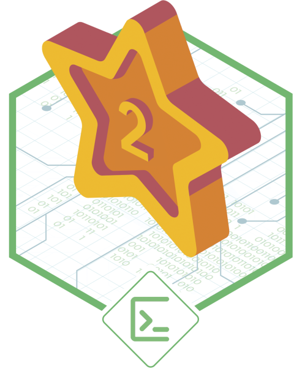

<h1 align="center">Financial Control Api</h1>
<h2 align="center">🚀 Easy Tracking for Your Outcomes.</h2>
<h3 align="center">CI/CD - Pipelines</h3>
<p align="center">
    <a href="https://github.com/rochajario/Financial-Control/actions/workflows/node.js.yml">
        
    </a>
    <br/>
    <a href="https://sonarcloud.io/summary/new_code?id=rochajario_Financial-Control">
        
    </a>
    <a href="https://sonarcloud.io/summary/new_code?id=rochajario_Financial-Control">
        
    </a>
    <a href="https://sonarcloud.io/summary/new_code?id=rochajario_Financial-Control">
        
    </a>
</p>
<h3 align="center">Alura Challenges Badges - Second Edition</h3>
<table align="center">
    <tr>
        <td>
            
        </td>
        <td>
            
        </td>
        <td>
            
        </td>
    </tr>
</table>

    A Simple way for you to monitor your consuming habits.
    Just put in your receivings an payments and get your metrics.

## Steps to run this project locally:
1. Make sure to have Mysql _(Version 8 or higer)_ and Node.Js _(Version 14 or higer)_ installed

2. Create a database with below command:
```sql
CREATE DATABASE `financial_control` DEFAULT CHARACTER SET utf8 ;
```
3. Create a new _.env_ file next to _package.json_ replacing angle brackets marked data with your own environment settings:
```
PORT = <Number of Application Port>
TYPEORM_CONNECTION = <mysql>
TYPEORM_HOST = <IP Address or Domain Name of Database Host>
TYPEORM_USERNAME = <Database User>
TYPEORM_PASSWORD = <Database Password>
TYPEORM_DATABASE = <Database Name - financial_control>
TYPEORM_PORT = <Database Port>
TYPEORM_SYNCHRONIZE = <true | false>
TYPEORM_LOGGING = <true | false>
TYPEORM_ENTITIES = src/entity/**/*.ts
JWT_SECRET= <random-key>
```

4. Run `npm i` command to install all project's depencies
5. Run `npm run test` command to be sure that everything is fine
6. Run `npm run dev` command to run the project locally
